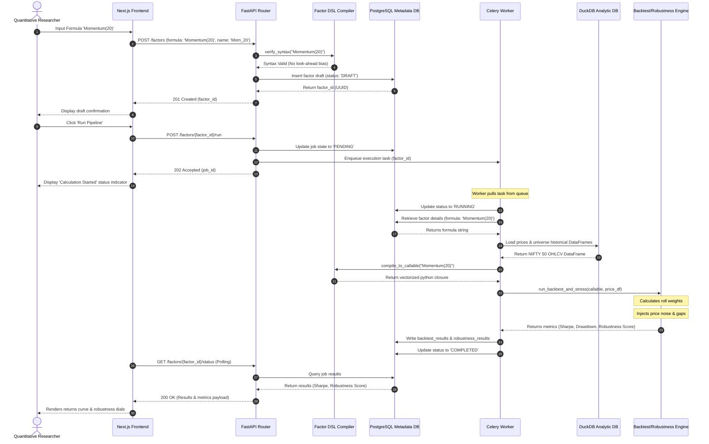

# AlphaLab — Architecture

> **Status:** Living document — updated after every phase
> **Current phase:** Phase 5 — Robustness Engine (Complete)
> **Last updated:** 2026-07-08

---

## 1. System Overview

AlphaLab is a two-service system backed by two databases.

```
┌──────────────────────────────────────────────────────────────────────┐
│  Next.js Frontend (web/)                          Phase 8            │
│  ┌─────────────────────┐  ┌──────────────────────────────────────┐  │
│  │  Factor Leaderboard │  │  Factor Detail + Research Report     │  │
│  └─────────────────────┘  └──────────────────────────────────────┘  │
└───────────────────────────────────┬──────────────────────────────────┘
                                    │ HTTP / REST
┌───────────────────────────────────▼──────────────────────────────────┐
│  FastAPI Application (src/alphalab/api/)          Phase 6            │
│                                                                       │
│  POST /experiments          POST /factors/{id}/backtest              │
│  GET  /experiments/{id}     GET  /factors/{id}/backtest              │
│  POST /factors              POST /factors/{id}/robustness            │
│  GET  /factors/{id}         GET  /factors/{id}/robustness            │
│  GET  /leaderboard          GET  /factors/{id}/report                │
└───────────┬───────────────────────────────────┬───────────────────────┘
            │                                   │
            │ SQLAlchemy (async)                │ Redis (enqueue job)
            │                                   │
┌───────────▼───────────┐           ┌───────────▼────────────────────┐
│  PostgreSQL           │           │  Celery Worker                 │
│  (Neon in production) │           │  (src/alphalab/worker/)        │
│                       │           │                                │
│  users                │  ◄────────│  run_backtest(factor_id)       │
│  experiments          │  results  │  run_robustness(factor_id)     │
│  factors              │           │                            │
│  backtest_results     │           │                            │
│  robustness_results   │           └───────────┬────────────────┘
│  job_status           │                       │ DuckDB (read)
│                       │           ┌───────────▼────────────────┐
│  Phase 6 schema       │           │  DuckDB                    │
└───────────────────────┘           │  (src/alphalab/data/)          │
                                    │                                │
                                    │  ohlcv (ticker, date, OHLCV)  │
                                    │  universe (point-in-time)      │
                                    │  factor_values (computed)      │
                                    │                                │
                                    │  Phase 1                       │
                                    └────────────────────────────────┘
```

---

## 2. Repository Structure

```
AlphaLab/
├── src/alphalab/          Installable Python package (src layout)
│   ├── api/               FastAPI application (Phase 6)
│   ├── data/              Market data layer (Phase 1)
│   │   ├── providers/     Strategy data providers (provider.py, yahoo_provider.py)
│   │   ├── universe/      Constituentresolvers (base.py, nifty50.py)
│   │   ├── storage/       Data persistence (base.py, duckdb.py, schema.py)
│   │   ├── validation/    Data checks (base.py, schema.py, quality.py, calendar.py, corporate_actions.py, suite.py, report.py)
│   │   ├── resources/     Static resources (nifty50_history.csv)
│   │   ├── transformer.py Raw DataFrame to MarketDataset converter
│   │   └── pipeline.py    Ingestion pipeline orchestrator
│   ├── dsl/               Factor DSL compiler (Phase 2)
│   ├── engine/            Backtest + Robustness engines (Phase 3, 5)
│   ├── worker/            Celery tasks (Phase 4)
│   ├── common/            Shared domain types (types.py), exceptions (exceptions.py)
│   ├── config/            Settings (settings.py)
│   └── utils/             Pure utilities
├── web/                   Next.js frontend (Phase 8)
├── tests/                 Test suite (mirrors src/ structure)
├── infra/                 Docker Compose, .env.example
├── docs/                  Public documentation (see data-layer.md for Data Layer details)
└── .github/               CI/CD workflows, templates
```

---

## 3. Package Responsibilities

| Package | Responsibility | Phase |
|---|---|---|
| `alphalab.api` | HTTP interface — routes, validation, auth, middleware | 6 |
| `alphalab.data` | Market data — fetch, validate, store, universe | 1 |
| `alphalab.dsl` | DSL compiler — lexer, parser, AST, validator, codegen | 2 |
| `alphalab.engine` | Evaluation — backtesting, robustness scoring | 3, 5 |
| `alphalab.worker` | Async jobs — Celery tasks for long-running computation | 4 |
| `alphalab.common` | Shared domain types, exceptions, enums | 1+ |
| `alphalab.config` | Settings, environment variable loading | 1 |
| `alphalab.utils` | Pure utility functions shared across packages | 1+ |

---

## 4. Data Flow & Block Rationale

AlphaLab operates as a coordinated data pipeline. Here is how information flows between nodes:

### Component-by-Component Data Flow

#### 1. Next.js Frontend Dashboard
- **Input**: User formula syntax, date boundaries, rebalance frequency parameters.
- **Processing**: Standardizes payload validation; parses authentication headers.
- **Output**: JSON payload to `POST /factors` or `POST /factors/{id}/run`.

#### 2. FastAPI Router
- **Input**: User-provided HTTP REST requests and body models.
- **Processing**: Resolves routing endpoints; delegates syntax checks; maps PostgreSQL transaction queries.
- **Output**: Job task IDs enqueued via Celery and immediate `202 Accepted` status codes.

#### 3. Factor DSL Compiler
- **Input**: Unvalidated math strings (e.g. `Momentum(20)`).
- **Processing**: Tokenizes and parses expressions into AST nodes; runs look-ahead checks to restrict future-leak references.
- **Output**: Transpiled, highly optimized NumPy/Pandas closures.

#### 4. Celery Worker
- **Input**: Task messages containing factor and execution parameters.
- **Processing**: Pulls tasks; controls DB writes; runs calculation engines.
- **Output**: Calculated performance tables written to PostgreSQL.

#### 5. PostgreSQL Metadata DB
- **Input**: Metric outputs, factor AST definitions, status flags.
- **Processing**: Manages transactional metadata integrity.
- **Output**: Stored user history records and pipeline metadata results.

#### 6. DuckDB Analytic DB
- **Input**: Cleaned historical stock prices and index constituent changes.
- **Processing**: Executes fast columnar window queries.
- **Output**: Clean historical price and index constituent DataFrames.

#### 7. Backtest/Robustness Engine
- **Input**: Callable compiled factor models and price DataFrames.
- **Processing**: Computes backtest returns; adds pricing noise (±0.5% to ±2.0%) and data gaps (5% to 20%); scores resilience.
- **Output**: Numerical performance matrices (Sharpe, Drawdowns, Robustness Scores).

#### 8. Data Ingestion Layer
- **Input**: Unprocessed source CSV tables and third-party APIs.
- **Processing**: Filters outliers, maps calendars, adjusts corporate actions.
- **Output**: Columnar tables imported to DuckDB.

---

### Sequence Flow (Factor Registration & Execution)

The following diagram tracks the lifecycle of an evaluation, from registration to final metric generation:



---

## 5. Database Schema

### PostgreSQL — Metadata

```sql
CREATE TABLE users (
    id          UUID PRIMARY KEY DEFAULT gen_random_uuid(),
    email       TEXT UNIQUE NOT NULL,
    name        TEXT NOT NULL,
    created_at  TIMESTAMPTZ NOT NULL DEFAULT now()
);

CREATE TABLE experiments (
    id          UUID PRIMARY KEY DEFAULT gen_random_uuid(),
    user_id     UUID NOT NULL REFERENCES users(id),
    name        TEXT NOT NULL,
    description TEXT,
    status      TEXT NOT NULL CHECK (status IN ('PENDING','RUNNING','FAILED','COMPLETED')),
    created_at  TIMESTAMPTZ NOT NULL DEFAULT now()
);

CREATE TABLE factors (
    id            UUID PRIMARY KEY DEFAULT gen_random_uuid(),
    experiment_id UUID NOT NULL REFERENCES experiments(id),
    name          TEXT NOT NULL,
    formula       TEXT NOT NULL,
    created_at    TIMESTAMPTZ NOT NULL DEFAULT now()
);

CREATE TABLE backtest_results (
    factor_id    UUID PRIMARY KEY REFERENCES factors(id),
    sharpe       DOUBLE PRECISION,
    sortino      DOUBLE PRECISION,
    calmar       DOUBLE PRECISION,
    max_drawdown DOUBLE PRECISION,
    turnover     DOUBLE PRECISION,
    ic           DOUBLE PRECISION,
    rank_ic      DOUBLE PRECISION
);

CREATE TABLE robustness_results (
    factor_id          UUID PRIMARY KEY REFERENCES factors(id),
    noise_score        DOUBLE PRECISION,
    missing_data_score DOUBLE PRECISION,
    overall_score      DOUBLE PRECISION,
    failure_reasons    JSONB
);
```

### DuckDB — Analytical Warehouse

```sql
CREATE TABLE ohlcv (
    ticker    VARCHAR NOT NULL,
    date      DATE NOT NULL,
    open      DOUBLE,
    high      DOUBLE,
    low       DOUBLE,
    close     DOUBLE,
    volume    BIGINT,
    adj_close DOUBLE,
    PRIMARY KEY (ticker, date)
);

CREATE TABLE universe (
    ticker      VARCHAR NOT NULL,
    index_name  VARCHAR NOT NULL,
    as_of_date  DATE NOT NULL,
    PRIMARY KEY (ticker, index_name, as_of_date)
);

CREATE TABLE factor_values (
    factor_id  UUID NOT NULL,
    ticker     VARCHAR NOT NULL,
    date       DATE NOT NULL,
    value      DOUBLE,
    PRIMARY KEY (factor_id, ticker, date)
);
```

---

## 6. Technology Stack

| Layer | Choice | Justification | Alternatives Considered |
|---|---|---|---|
| API | FastAPI | Async, Python-native, OpenAPI generation | Flask (synchronous), Django REST (heavy) |
| Task Queue | Celery + Redis | Measured latency need; Redis is Celery's recommended broker | RQ (simpler but less mature), threading (wrong abstraction) |
| Metadata DB | PostgreSQL | Relational metadata, ACID, industry standard | SQLite (not production-grade), MySQL (less feature-rich) |
| Analytical DB | DuckDB | Columnar, embedded, no server, fast rolling-window computation | Pandas in-memory (no persistence), TimescaleDB (heavy) |
| Auth | JWT (PyJWT) | Stateless, standard | Session-based (requires sticky sessions), OAuth (overkill for v1) |
| Frontend | Next.js | SSR, TypeScript, React ecosystem | React SPA (no SSR), Django templates (not portfolio-grade) |
| CI/CD | GitHub Actions | Repository-native, no external service | CircleCI, Jenkins |
| Deployment | Render (API) + Vercel (web) + Neon (DB) | Free tier, zero-ops | AWS (complex), Heroku (expensive) |

**Explicitly excluded from v1:** MLflow, Sentry, microservice monorepo tooling, multi-queue Celery.

---

## 7. Current Implementation State (Phase 3)

**What exists:**
- Complete repository structure with `src/` layout
- Eight package skeletons with documented future responsibilities
- `pyproject.toml` with full tool configuration
- Docker Compose with PostgreSQL + Redis
- Data Layer (Phase 1): Ingestion pipelines, schema validation, DuckDB storage, and NIFTY50 point-in-time universe.
- API & Worker Foundation (Phase 1): FastAPI routing, JWT auth, SQLAlchemy connections, Alembic migrations, Celery tasks configuration.
- Factor DSL Compiler (Phase 2): Lexer, Parser, AST, Static Look-ahead Validator, and Pandas Code Generator.
- Backtesting Engine (Phase 3): Vectorized `FactorEvaluator`, cross-sectional `PortfolioConstructor`, and `PerformanceCalculator`.

**What does not exist yet:**
- Async job orchestration for the engine (Phase 4)
- Robustness evaluation engine (Phase 5)
- User-facing REST API for submitting factors (Phase 6)
- Frontend Leaderboard / Factor IDE (Phase 8)

Everything above is intentional. Phase 0 is the engineering foundation only.
