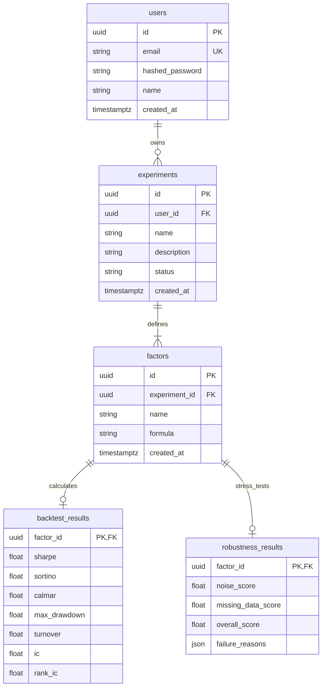

# Backend Foundation Architecture Guide

This document describes the design and components of the AlphaLab Backend and Asynchronous Worker infrastructure (Developer B tasks).

---

## 1. Directory Structure

The backend foundation is subdivided into two primary modules:

```
src/alphalab/
├── api/                   FastAPI web service application layer
│   ├── auth/              Security, hashing, and JWT token handlers
│   ├── database/          SQLAlchemy async connections and session generation
│   ├── models/            PostgreSQL table schema declarations
│   ├── routers/           HTTP endpoint routers (auth, users, experiments)
│   └── main.py            Application entrypoint assembling routers
└── worker/                Celery background task execution layer
    ├── celery.py          Celery instance broker settings
    └── tasks.py           Background tasks (backtest and robustness)
```

---

## 2. Component Design

### 2.1. Async Database Engine (SQLAlchemy + asyncpg)
To prevent blocking the FastAPI event loop during heavy requests, the database interactions are entirely asynchronous.
*   **Engine**: Configured in `connection.py` using `postgresql+asyncpg` driver.
*   **Session Management**: `async_sessionmaker` constructs instances. The helper function `get_db_session` acts as a FastAPI dependency, yielding a scoped session per request and cleaning it up after completion.

### 2.2. Schema Relationships (PostgreSQL)



### 2.3. Background Task Pipeline (Celery + Redis)
1.  **Submission**: A user submits factor formulas via `POST /experiments`.
2.  **Insertion**: The API inserts the metadata into PostgreSQL and updates status to `RUNNING`.
3.  **Enqueuing**: The API sends tasks (`run_backtest_task` and `run_robustness_task`) to the **Redis Broker** via `.delay()`.
4.  **Worker Processing**: Celery workers fetch tasks from Redis. Because Celery workers are synchronous, they wrap async operations inside `asyncio.run()`, query the factors, execute analysis, and write results back to PostgreSQL.
5.  **Completion**: Each task runs an atomic checks routine. If all factors for an experiment have both backtesting and robustness results saved, the experiment status is updated to `COMPLETED`.

---

## 3. Database Migrations (Alembic)

Migrations are managed through Alembic using async configurations:
*   **`alembic.ini`**: Unified config file in root.
*   **`alembic/env.py`**: Configured to import `Base.metadata` from our schema and load database URL credentials dynamically from `Settings`.
*   **`alembic/versions/`**: Holds generated migration history logs.
