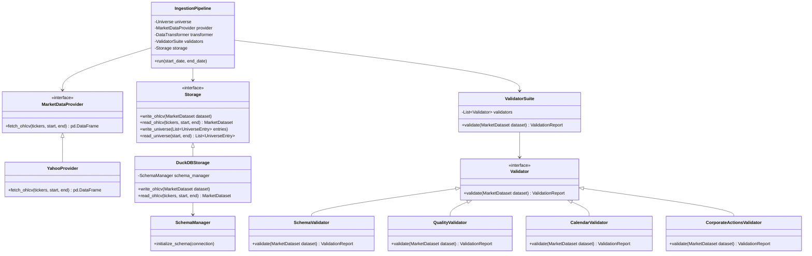

# AlphaLab — Data Layer Architecture

This document describes the design, structural layout, and data flow of the market data ingestion and storage subsystem (Phase 1).

---

## 1. Design Philosophy

The Data Layer has three primary duties:
1.  **Isolation**: Prevent external vendor APIs (like Yahoo Finance) from leaking into the core simulation and research modules.
2.  **Look-ahead / Survivorship Bias Prevention**: Enforce historical point-in-time constituent mapping using intervals, ensuring the backtester only accesses information that was available at that specific historical point-in-time.
3.  **Strict Validation Reporting**: Check data schema correctness, identify missing days (using a market calendar), detect anomalous price jumps, and flag corporate actions, without automatically modifying data behind the scenes.

---

## 2. Core Abstractions and Domain Models

Instead of using raw dataframes, the data layer uses structured domain objects to pass datasets and metadata between components:

```
┌────────────────────────────────────────────────────────┐
│ MarketDataset (Domain Dataclass)                        │
│ ├─ data: pd.DataFrame (standardized OHLCV columns)      │
│ ├─ start_date: date                                    │
│ ├─ end_date: date                                      │
│ └─ tickers: List[str]                                  │
└──────────────────────────┬─────────────────────────────┘
                           │
                           ▼
┌────────────────────────────────────────────────────────┐
│ ValidationReport                                       │
│ ├─ issues: List[ValidationIssue]                       │
│ └─ has_errors() -> bool                                │
└────────────────────────────────────────────────────────┘
```

### Domain Types (`alphalab.common.types`)
*   **`MarketDataset`**: Wraps a pandas DataFrame containing historical price data. Enforces uniform columns (`ticker`, `date`, `open`, `high`, `low`, `close`, `volume`, `adj_close`) and records date ranges.
*   **`UniverseEntry`**: Describes index constituent membership with a duration interval (`ticker`, `index_name`, `effective_from`, `effective_to`).
*   **`ValidationIssue`**: Records individual diagnostics (`ticker`, `issue_type`, `description`, `severity`).
*   **`ValidationReport`**: Orchestrates a collection of issues.

---

## 3. Structural Class Architecture



---

## 4. End-to-End Control and Data Flow

1.  **Constituent Resolution**: The `IngestionPipeline` requests constituent intervals for NIFTY 50 via the `Universe` loader.
2.  **Ingestion**: `YahooProvider` downloads raw price history in vectorized dataset format (DataFrame).
3.  **Standardization**: `DataTransformer` reformats headers, timezone flags, and timestamps.
4.  **Dataset Wrap**: The standardized DataFrame is wrapped in a `MarketDataset` domain object.
5.  **Orchestrated Validation**: The pipeline calls the `ValidatorSuite` which runs all registered validation modules. Each returns diagnostic reports which are merged into a single `ValidationReport`.
6.  **Pipeline Filtering**: The pipeline inspects the `ValidationReport`, writes warnings/errors to structured logs, removes invalid records, and prepares clean records.
7.  **Storage**: The final clean `MarketDataset` is written to `DuckDBStorage`.

---

## 5. Schema Design

Analytical data tables are separated from relational application databases and kept in DuckDB:

### Table `ohlcv`
Columnar database optimized for rolling historical calculations:
*   `ticker`: VARCHAR (Primary Key)
*   `date`: DATE (Primary Key)
*   `open`: DOUBLE
*   `high`: DOUBLE
*   `low`: DOUBLE
*   `close`: DOUBLE
*   `volume`: BIGINT
*   `adj_close`: DOUBLE

### Table `universe`
Tracks index constituent membership intervals historically to prevent survivorship bias:
*   `ticker`: VARCHAR (Primary Key)
*   `index_name`: VARCHAR (Primary Key)
*   `effective_from`: DATE (Primary Key)
*   `effective_to`: DATE (Nullable — represents active constituent if NULL)
