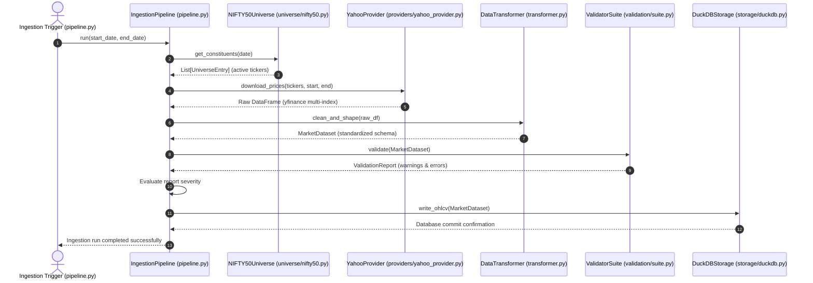

# AlphaLab — Data Layer Architecture

> **Component:** `alphalab.data`
> **Status:** Complete ✅
> **Author:** Vaishnavi Rai, Akshat Kankani
> **Last updated:** 2026-07-06

---

## 1. Design Philosophy

The Data Ingestion & Storage subsystem (Phase 1) is designed around three core principles:
1.  **Isolation**: Prevents external pricing vendor APIs (e.g. Yahoo Finance) from leaking raw formatting structures into the core research and backtesting engines.
2.  **Bias Prevention**: Enforces a historical point-in-time constituent mapping using duration intervals to eliminate survivorship and look-ahead biases.
3.  **Strict Validation Reporting**: Runs diagnostic schema, calendar, quality, and action check suites on the price series to log data anomalies without silently modifying raw data.

---

## 2. Flow of Control

The following sequence diagram illustrates the flow of control, step-by-step calls, and data return formats between the data package modules during an ingestion run:

---

## 3. Detailed Component Code Logic

### 3.1. Ingestion & Cleaners

#### `transformer.py` (Data Transformer)
*   **Logic**: Parses the raw pricing DataFrames, resetting date indexes and standardizing columns:
    *   Maps columns to standard names: `ticker`, `date`, `open`, `high`, `low`, `close`, `volume`, `adj_close`.
    *   Forward-fills (`ffill`) minor pricing gaps (e.g., occasional missing ticks) to keep price arrays continuous.
    *   Converts pandas datetime indexes to pure Python `datetime.date` objects.
    *   Packs the output into the `MarketDataset` domain dataclass contract (which self-validates the schema in `__post_init__`).

#### `pipeline.py` (Orchestrator)
*   **Logic**: Coordinates the entire ingestion loop:
    *   Calls the `Universe` loader to resolve NIFTY 50 membership intervals for the target range.
    *   Triggers `YahooProvider` downloads in throttled concurrent chunks.
    *   Calls `DataTransformer` to clean outputs.
    *   Orchestrates the `ValidatorSuite`. If the suite yields severe `ValidationIssue` errors, it halts; if it only returns warnings, it writes them to logs and proceeds.
    *   Saves the dataset to `DuckDBStorage`.

### 3.2. Data Providers (`providers/`)

*   **`provider.py`**: Abstract Base Class defining the contract for down-loading price feeds: `download_prices(tickers, start, end)`.
*   **`yahoo_provider.py`**: Implementation using `yfinance`:
    *   **Vectorized Index Flattening**: Extracts data in bulk. Yahoo returns a multi-index header (e.g. `(Close, TCS.NS)`). The provider flattens and normalizes this into a tidy format: one row per `(ticker, date)` combination.
    *   **Throttling**: Automatically implements exponential backoff to handle HTTP `429 Too Many Requests` or connection timeouts.

### 3.3. Point-in-Time Universe (`universe/`)

*   **`resources/nifty50_history.csv`**: A local database detailing index entry (`effective_from`) and exit (`effective_to`) dates for constituents from 2015 to present.
*   **`nifty50.py`**: Resolves index members as of a specific date $T$:
    *   Filters rows where $\text{effective\_from} \le T \le \text{effective\_to (or active)}$.
    *   Returns a list of `UniverseEntry` objects containing the active tickers for that day.

### 3.4. Columnar Storage (`storage/`)

*   **`schema.py`**: Defines the DuckDB tables schema:
    *   `daily_prices`: `ticker` (VARCHAR), `date` (DATE), `open` (DOUBLE), `high` (DOUBLE), `low` (DOUBLE), `close` (DOUBLE), `volume` (BIGINT), `adj_close` (DOUBLE).
    *   `universe_constituents`: constituent historical records.
    *   Composite primary key index on `(ticker, date)` to speed up time-series factor computations.
*   **`duckdb.py`**: Local file-based OLAP storage driver:
    *   Uses columnar layouts, which are optimized for rolling-window queries compared to row-oriented databases.
    *   Implements **vectorized inserts** to write entire Pandas DataFrames in memory-to-memory block writes, bypassing slow row-by-row `INSERT` queries.

### 3.5. Data Quality Suite (`validation/`)

*   **`report.py`**: Aggregates `ValidationIssue` warnings and errors.
*   **`suite.py`**: Orchestrates and executes the following checks:
    1.  **`schema.py`**: Checks that all 8 OHLCV columns exist and that volume is strictly positive.
    2.  **`quality.py`**: Flags missing daily prices or extreme overnight jumps ($>50\%$).
    3.  **`calendar.py`**: Asserts weekday alignments and checks that weekends contain no records.
    4.  **`corporate_actions.py`**: Detects anomalies such as sharp price drops accompanied by volume spikes, flagging them as potential unadjusted stock splits or dividends.
